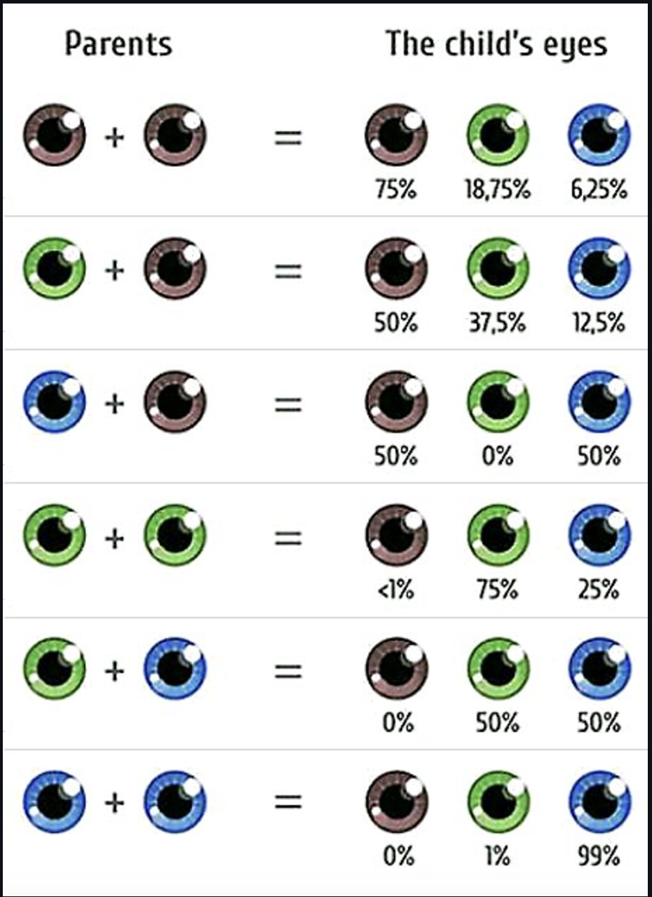

## Challenge: Odds & Evens

### MVP:

Check if a number is odd or even

1. Create variable `n`
1. Write an if / else block
1. If the number passed in is even return a string `"n is even"`
1. If the number is odd return a string `"n is odd"`

## Challenge: Comparing Numbers

### MVP:

Check for the smallest value

1. Create two variables `x` & `y`
1. Write an if / else block
1. It should compare a number `x` to another number `y`
1. It should print ("`x` is greater than `y`") in the console
1. Or "`x` is smaller than `y`"
1. Or "`x` is equal to `y`"
1. Depending on the value of `x` and `y`

## Challenge: User Input Type

### MVP:

Console log the user's input depending on the data type

1. Create a variable `userInput`
1. Write an if / else block
1. If the input is a number, it should console log that number but squared
1. If the input is a string, it should console log that input
1. If the input is anything else, the console should say "invalid input"

## Challenge: Tell me the day!

### MVP:

Create a switch block that will log a string for each day of the week.

1. Create a variable called `day`
2. The switch will be given a number and return the matching days of the week
3. e.g. if `day = 2`, the switch should print `Today is Tuesday` in the console.
4. Your switch block should also handle numbers out of range

## Challenge: Eye Colour

### MVP:

Tell the user what eye colour their child would have.

1. Create two variables `parent1` and `parent2`
2. Given the eye colour of each parent, it should console log the probability
   of their child having different eye colours, for example:
   `Your eye colours are brown and blue, the chances of your child having blue eyes is --%, brown is --% and green is --%`
3. Use the following image as a reference
   
